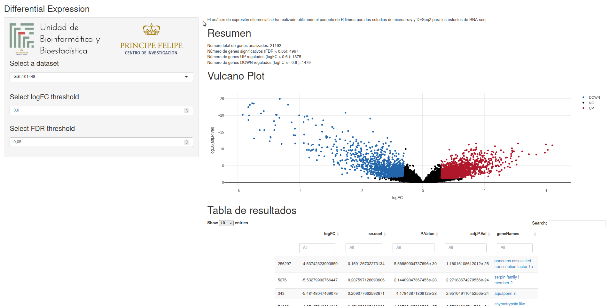

# Shiny Report

Shiny Dashboard to explore results from different analyses, such as
Differential Expression analysis


## Available Analysis

- [Differential Expression Analysis](#differential-expression)

- [Differential Expression Meta-analysis](#differential-expression-meta-analysis)

- [Protein interaction network analysis](#protein-interaction-network-analysis)


### Differential Expression

The input must be an RDS file storing an R list object. Each element of the list
must be a data.frame storing the differential expression results for a dataset. The
code is designed to work with `limma::topTable()` output format, with the gene names
added as a new column. If the results come from, for example, `DESeq2` package, the
column names (or the code) have to be manually edited. The essential colums are: logFC,
se.coef, P.Value, adj.P.Val and geneNames. 

The se.coef column is computed by default by `DESeq2`, but not by `limma`. Following
[Gordon Smith's advice](https://support.bioconductor.org/p/70175/ "Bioconductor post"),
it can be computed like this:


```r
se.coef <- sqrt(fit$s2.post) * fit$stdev.unscaled
```

This section shows a summary of analyzed genes and statistically significan genes,
a summary vulcano plot and a results table.


### Differential Expression Meta-analysis

The input must be an RDS file storing the results from `metafor::rma()`,
and a tsv file containing at least the following columns:

- ID: ENTREZ ID
- name: Gene name
- summary_logFC: logFC value computed by the meta-analysis
- p.adjust: FDR
- studies: number of studies in which the gene has been evaluated

This section shows a summary of analyzed genes and statistically significan genes,
a summary vulcano plot, a results table and a forest plot of a selected gene.

### Protein interaction network analysis

This section opens a new tab at the current browser showing a protein interaction
network analysis performed by [STRING](https://string-db.org/).

## Demo


